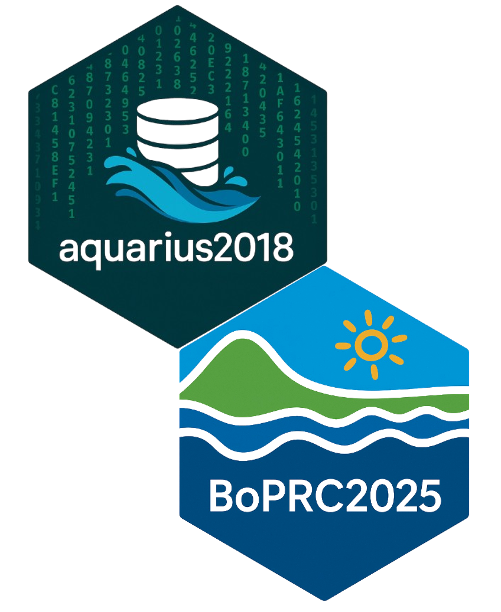
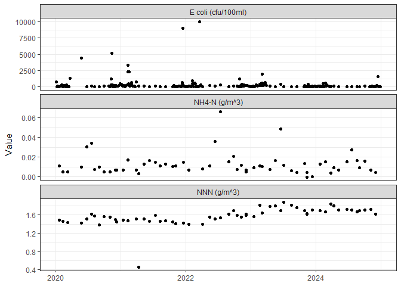
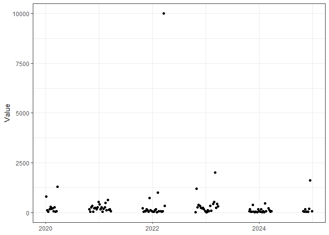
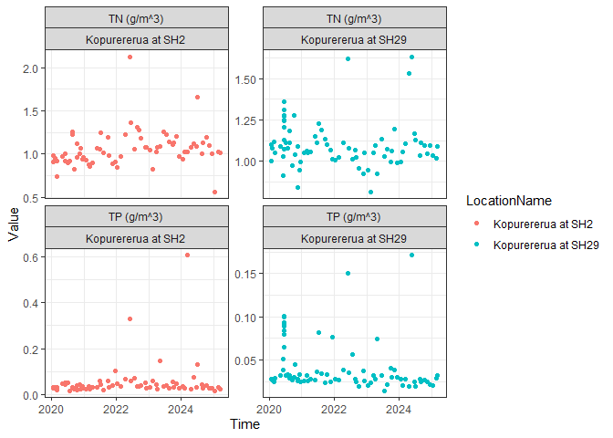
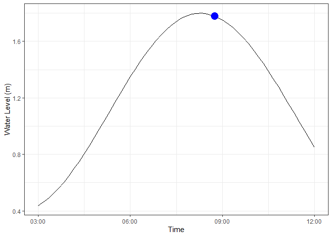
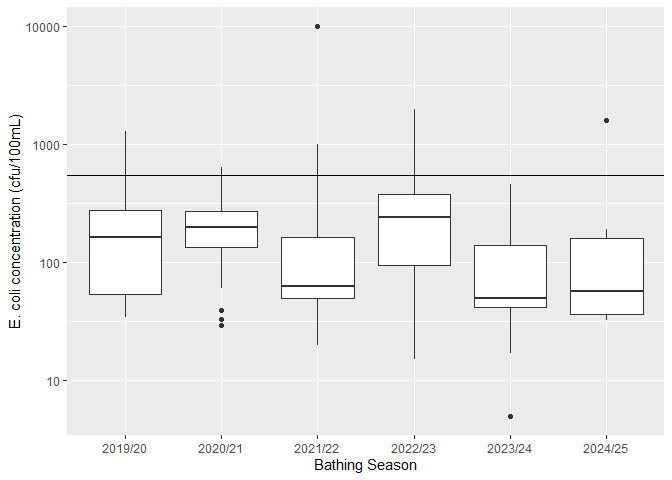

BOPRC R Tutorial 2 - Introduction to BOPRC’s Internal Packages:
================

## Overview

This lesson is designed to introduce you to two of our internal BOPRC
packages:



- [**aquarius2018**](https://github.com/JamesBOPRC/aquarius2018)
- [**BoPRC2025**](https://github.com/JamesBOPRC/BoPRC2025)

These packages are only used by BOPRC and are therefore not publicly
available. Therefore, installation is slightly different to packages
stored in the CRAN repository.

Both of these packages are stored on GitHub - an online platform for 
version control and collaboration, allowing developers to manage and 
share their code projects efficiently.  

The compiled version of these packages can be downloaded as a tarball
file (like a zip file) from the corresponding Github repositories, but
have also been included in the 'BOPRC_R_Course_Lesson_2' repository.  
This means that both tarball files should be in your project folder once
you have downloaded today's lesson (by clicking on the green button and
selecting 'Download ZIP').  

**Run the following code to install aquarius2018 and BoPRC2025:** 

```{r, message=FALSE,eval=FALSE}
#for aquarius2018 
install.packages("aquarius2018_1.1.2.tar.gz", repos = NULL, type = "source")

```

```{r, message=FALSE,eval=FALSE}
#for BoPRC2025
install.packages("BoPRC2025_0.2.0.tar.gz", repos = NULL, type = "source")

```

Now you should be able to each package using the following commands:

``` r
library(aquarius2018)
library(BoPRC2025)
```

The other packages that we will use in this
tutorial are:

- **tidyverse**

Before attempting to install these packages, make sure your Primary CRAN
Repository is set to:

- **“New Zealand \[https\] - University of Auckland”**

To check this, click ‘Tools’ –\> ‘Global Options’ –\> ‘Packages’. Click
‘Change’ if you need to adjust this.

You can download most packages by clicking on the ‘Install’ button on
the ‘packages’ tab in the lower right window pane. Then in the Install
Packages popup, select ‘Repository (CRAN)’ from the ‘Install from’ drop
box and type the name of the package you wish to download (e.g., dplyr).

Once all of these packages are installed you can load them using the
‘library’ function:

``` r
library(tidyverse)
library(lubridate)
```

# The aquarius2018 Package

The Aquarius package includes functions that enable the user to link and
extract data directly from our Aquarius database.

### Searching for Site Information

We will explore the functionality of the Aquarius package by getting
basic water quality data from a site of interest, let’s say ‘Pongakawa
at SH2’. This function requires the siteID in order to know exactly what
site we are talking about. Sometimes you may have this and can skip the
next step, but in this case we will use the Aquarius package to search
for the correct site ID which is housed in Aquarius (the database)
tables.

Use the function ‘searchlocationname()’ to conduct a wildcard search for
all sites that have ‘Pongakawa at’ in the title. There are quite a few,
so it would pay to save this as a dataframe for easier reference.

``` r
Site_List <- searchlocationnames("Pongakawa at*")
```

------------------------------------------------------------------------

***Challenge 1:*** *You get a call from the switchboard with someone
requesting water quality information from the ‘Te Awangarara Stream’. Do
we have any monitoring sites on that stream?*

<details>
<summary>
Click to see a solution
</summary>

``` r
searchlocationnames("Te Awangarara")

# Yes, there is one site located at the headwaters.
```

</details>

------------------------------------------------------------------------

Use the ‘view’ function to view the object you just created, or click on
the name ‘Site_List’ in the Data pane on the right.

``` r
View(Site_List)
```

We can see that ‘Pongakawa at SH2’ is in the 3rd row of this data frame.
We are interested in the ‘SiteID’, which is called the ‘identifier’ in
this dataframe.

The code below stores the information from row 3, column 1 as an object
called ‘SiteID’. We can use this as input for other functions.

``` r
# store the 'siteID' as an object that we can call upon later.  The syntax is
# DATAFILE[ROW,COLUMN].
SiteID <- Site_List[3, 1]
SiteID
```

    ## [1] "GN922883"

Great, now we know that the siteID is ‘GN922883’ and this value is
stored as the object ‘SiteID’. Now we can move on to the next step.
Note - you can easily circumvent this step by saving important SiteID’s
in your project (e.g., as a comment) or by finding SiteID’s on Geoview.

### The ‘datasets’ Function

Now that we know the siteID of our site of interest, lets find out what
data is available. The ‘datasets’ function will display all datasets
stored under the site.

``` r
# Create an object with all discrete WQ parameters at the site.
Datasets <- datasets(SiteID)
head(Datasets)
```

------------------------------------------------------------------------

***Challenge 2:*** *What water quality information is available on the
‘Te Awangarara Stream’? When was the most recent sample collected? How
many samples do you think have been collected at this site?*

<details>
<summary>
Click to see a solution
</summary>

``` r
datasets("KK046457")

# We have sample results for Dissolved Reactive Phosphorus (DRP), Faecal
# Coliforms (FC), Ammoniacal Nitrogen (NH4-N), and Nitrate-Nitrite-Nitrogen
# (NNN). We can see that the 'RawEndTime' is equal to '2005-03-17' for all
# parameters, which means the most recent data point is over 20 years old!  We
# can also see that the 'RawStartTime' is also '2005-03-17', which suggests
# that there has only ever been one sample collected.  Perhaps the site is
# really hard to get to?
```

</details>

------------------------------------------------------------------------

### The ‘getdata’ Function

‘getdata’ is the most basic function for extracting information from the
database, and is used as a building block in the more complex function
‘AQMultiExtractFlat’ described below. ‘getdata’ requires a bare minimum
of a ‘DataID’, which is stored in the ‘Datasets’ object. You can include
additional inputs, such as the start and end time, to filter the
extract, or add ‘LabMeta = TRUE’ or ‘FieldObs = TRUE’ to extract
associated metadata. Type ?getdata to learn more.

``` r
# use the getdata function to extract the entire NNN dataset for 'Pongakawa at
# SH2'.
getdata("NNN.LabResult@GN922883")
```

------------------------------------------------------------------------

***Challenge 3:*** *Find out the value of all parameters collected in
2005 at the ‘Te Awangarara Stream’ site.*

<details>
<summary>
Click to see a solution
</summary>

``` r
getdata("FC.LabResult@KK046457")
getdata("DRP.LabResult@KK046457")
getdata("NNN.LabResult@KK046457")
getdata("NH4-N.LabResult@KK046457")


# FC result is 130 cfu/100ml.  DRP result is 0.029 g/m3 NNN result is 0.047
# g/m3 NH4-N result is 0.029 g/m3

# Wouldn't it be easier if this required a single line of code rather than
# four?  It seems strange that DRP and NH4-N are identical???
```

</details>

------------------------------------------------------------------------

### The ‘LocationWQParameters’ Function

Rather than calling ‘datasets’ for each site, you can use the
‘LocationWQParameters’ function. This provides the display names of all
discrete water quality parameters available at a given site (i.e., a
subset of the Dataset file you created above). The display name is the
name that you see in ‘Aquarius Springboard’ and is the required input
for the AQMultiExtract function, e.g. Total Nitrogen = “TN”

``` r
# Create an object with all discrete WQ parameters at the site.
AvailableWQParams <- LocationWQParameters(SiteID)
```

We can use this list to define the parameters of interest that we want
to extract from the database. Let’s define a parameter list of: E. coli,
Nitrite Nitrate (as N), and Ammoniacal N.

``` r
ParamList <- c("E coli", "NNN", "NH4-N")
```

### The AQMultiExtractFlat Function

This function is arguably the most useful function in the Aquarius
package toolbox. It is used for extracting datasets with multiple sites
and multiple parameters.

The syntax requirements for AQMultiExtractFlat are:

- **sitelist** - a list of site ID’s.
- **params** - a list of parameters as display names.
- **start** - (optional) start date in the format YYYY-MM-DD.
- **end** - (optional) end date in the format YYYY-MM-DD.

In this case the sitelist is a list of one, i.e. SiteID, and the
paramlist is that above. We will analyse data between the 1st January
2020 and the 1st January 2025.

AQMultiExtractFlat will extract the requested data query in long format
and include any metadata that is stored in the database. There is
another function called AQMultiExtract which has the same input
requirements, but outputs data in a wide format (i.e., Parameters will
be columns). The downside to this is that no metadata will be included.

``` r
WQData_Pongakawa <- AQMultiExtractFlat(SiteID, ParamList, start = "2020-01-01", end = "2025-01-01")
```

It’s as easy as that. You can save this data to a csv file if you wish.

``` r
write.csv(WQData_Pongakawa, file = "Pongakawa_Data.csv", row.names = FALSE)
```

You might also want to briefly check over the data to ensure that
everything is in order. A simple way to do this is using the ‘tidyverse’
ecosystem. In this case we can pass the object (WQData_Pongakawa) to the
ggplot function to create a plot.

``` r
WQData_Pongakawa %>%
    ggplot() + geom_point(aes(x = Time, y = Value)) + facet_wrap(~Parameter, scales = "free_y",
    nrow = 3) + xlab(NULL) + theme_bw()
```

<!-- -->

We can see that there is something strange in the E. coli dataset, where
the frequency increases over the summer period. This is due to the
collection of additional recreational bathing data at this site between
October and April the following year. We should remove these data from
the dataset if we are planning to run analyses designed for monthly
datasets (e.g., assessment against most NPS-FM attributes or trend
analysis. Luckily recreational bathing data and routine monthly samples
are defined in the ‘qualifiers’ column of a ‘AQMultiExtractFlat’
dataset.

Use the filter function in the tidyverse pipeline below to see what the
data looks like if only ‘routine’ data are included. Note the code below
doesn’t make any changes to the dataset or create any new objects, which
is why tidyverse is great for exploring data.

``` r
WQData_Pongakawa %>%
    filter(Qualifiers == "Routine") %>%
    ggplot() + geom_point(aes(x = Time, y = Value)) + facet_wrap(~Parameter, scales = "free_y",
    nrow = 3) + xlab(NULL) + theme_bw()
```

<!-- -->

This looks much better and we might want to put the filtered data aside as
‘routine’ dataset.

``` r
Routine_Data <- WQData_Pongakawa %>%
    filter(Qualifiers == "Routine")
```

We can also create a recreational bathing object for future use.

``` r
# Use tidyverse to filter and plot a recreational bathing dataset
WQData_Pongakawa %>%
    filter(Parameter == "E coli (cfu/100ml)") %>%
    filter(Qualifiers == "Recreational") %>%
    ggplot() + geom_point(aes(x = Time, y = Value)) + xlab(NULL) + theme_bw()
```

<!-- -->

``` r
# If we're happy with how this works then we can put this aside for future use.
Rec_Bathing_Data <- WQData_Pongakawa %>%
    filter(Parameter == "E coli (cfu/100ml)") %>%
    filter(Qualifiers == "Recreational")
```

------------------------------------------------------------------------

***Challenge 4:*** *Extract and plot TN and TP data from ‘Kopurererua at
SH2’ and ‘Kopurererua at SH29’, collected after 1st January 2020, using
AQMultiExtractFlat and tidyerse. Hint - use geom_point(aes(…, colour =
LocationName)) to display sites as different colours on the same panel.
You can also facet by more than one variable.*

<details>
<summary>
Click to see a solution
</summary>

``` r
# find out the site id for Kopurererua sites
searchlocationnames("Kopurererua at *")

# extract data from both sites
Kopu_Data <- AQMultiExtractFlat(sitelist = c("DO406909", "DP784306"), param = c("TN",
    "TP"), start = "2020-01-01")

# plot the data.  Use facet_wrap with two parameters.
Kopu_Data %>%
    ggplot() + geom_point(aes(x = Time, y = Value, colour = LocationName)) + facet_wrap(~Parameter +
    LocationName, scales = "free_y") + theme_bw()
```

<!-- -->

``` r
# for extra credit - what is wrong with this graph?
```

</details>

------------------------------------------------------------------------

# The BoPRC2025 package

The BoPRC2025 package contains a number of functions that might be
useful to staff. Think of it as a toolbox; functions contained within
have been built out of necessity and stored for other people to use in
the future. The intention is to expand the list of functions as users
write or discover methods that may be useful for other staff. This is a
great way to achieve standardised and auditable outputs for reporting
purposes.

Use [github
discussions](https://github.com/JamesBOPRC/BoPRC2025/discussions/1) to
raise any development requests that you might have.

Use the [github issues](https://github.com/JamesBOPRC/BoPRC2025/issues)
to log any problems you might encounter.

## Functions within BoPRC2025

The following functions are contained within BoPRC2025. Most have an
associated help file that can help with the syntax and arguments. Use
?FUNCTIONNAME bring up the help page, or click on BoPRC2025 within the
Packages tab to see a list of available help pages.

We will only demonstrate the use of two functions within each category,
so it’s up to you to explore the rest!

### Generic Functions

These functions are not specific to any analysis but may be useful for
everyday purposes.

- **Write.Excel** - copies a dataframe to the clipboard in an excel
  format.
- **Convert.Columns** - converts all columns to a defined class.
- **Percentile_Plot** - produces a simple plot where a dot represents a
  percentile input.
- **Continuous_TS** - figures out the earliest date before a gap occurs
  in a timeseries.
- **TidalFromDate** - returns the proportion of the tidal height for a
  given date.

**Write.Excel** is extremely useful for copying datasets out of R into
Excel using the clipboard.

``` r
#lets copy the WQData_Pongakawa dataset and paste it in an excel sheet. 
#Run the following code and then open Excel, select a cell, and paste.
Write.Excel(WQData_Pongakawa)
```

**TidalFromDate** is a new function that can be used to determine how
close to high/low tide your sample was collected. You just need to enter
a timestamp (YYYY-mm-dd HH:MM:SS) and a choice of the following as a
secondary port:

- Bowentown
- KauriPoint
- Maketu
- Ohope
- Omokoroa
- Opotiki
- Rangitaiki
- TownWharf
- Whakatane

The tide times for Tauranga (the primary port) will be used if you do
not enter a secondary port. This function will only return an output if
the date is between 1st January 2012 and 31st December 2024 due to the
availability of tide tables. We will aim to update the tide tables every
year as they become available.

``` r
#find tidal information for Opotiki on the 24th June 2024.
TidalFromDate("2024-06-24 08:45:00",SecondaryPort = "Opotiki")
```

The function returns an estimated water level of 1.78m, a proportion of
0.99 and that the next tide is LOW. This is shown graphically in the
plot below, with the blue dot representing our inputted time.

``` r
#create a sequence of times that covers our timestamp.
time <- seq.POSIXt(as.POSIXct("2024-06-24 03:00:00",tz="etc/GMT+12"),to = as.POSIXct("2024-06-24 12:00:00",tz="etc/GMT+12"),by = "10 mins")

#create a dataframe of time vs tidal height
Tidal_Height_DF <- data.frame(Time=time, height=NA)

#this loop looks tricky but it's not really that bad.  
#It loops through all of the rows in Tidal_Height_DF and 
#calculates the Estimated Water Level for each of the times.  
for(i in 1:nrow(Tidal_Height_DF)){
  Tidal_Height_DF$height[i] <- as.numeric(TidalFromDate(Tidal_Height_DF$Time[i],SecondaryPort = "Opotiki")$EstimatedWaterLevel)
}

#create a plot of the data
Tidal_Height_DF%>%
  ggplot()+
  geom_path(aes(x=Time,y=height))+
  xlab("Time")+
  ylab("Water Level (m)")+
  geom_point(x=as.POSIXct("2024-06-24 08:45:00",tz="etc/GMT+12"), y=1.779,size=5,colour="blue")+
  theme_bw()
```

<!-- -->

Finally, you can access the datasets for each primary and secondary port
using the data() function.

``` r
data("KauriPoint")
KauriPoint
```

------------------------------------------------------------------------

***Challenge 5:*** *You collect a sample from Waihi Estuary at 10:37am
on January 23rd 2023. What is the estimated tidal height and state of
the tide (tidal proportion)?*

<details>
<summary>
Click to see a solution
</summary>

``` r
TidalFromDate("2023-01-23 10:37:00", SecondaryPort = "Maketu")

# Time = 2023-01-23 10:37:00 EstimatedWaterLevel = 1.514 NextTide = L
# Proportion = 0.730
```

</details>

------------------------------------------------------------------------

### Bathing Functions

These functions are specifically designed for analysing bathing water
quality datasets.

- **Bathing_Season** - returns the bathing season for a given date.
- **MAC** - calculates the microbial assessment category.
- **FW_Action_Levels** - Summarises data according to the percentage of
  samples within green, amber, and red thresholds.
- **Hazen.Percentile** - calculates the hazen percentile for a dataset.

**Bathing_Season** is really useful for attributing a bathing season or
hydrological year to timestamps. We use the tidyverse method of
‘mutate’, below, to apply this function to a dataset.

``` r
Rec_Bathing_Data %>%
  mutate(Season = Bathing_Season(Time))%>%
  select(Site, LocationName, Time, Value, Season)
```

**Hazen.Percentile** is used for analysing bathing water quality data.
This method of calculating a percentile is particularly useful for small
sample sizes. The formula is as follows:

$$rHazen = 1/2 + p.n $$

Where: \* p is the desired percentile \* n is the number of data points

The ’Microbiological Water Quality Guidelines for Marine and Freshwater
Recreational Areas (2003) states:

> *“It is important to note there are several ways to calculate
> percentiles. Each uses a different formula, generating different
> results. The Hazen method has been chosen for these guidelines, as it
> tends to be about the ‘middle’ of all the options.”*

You need to input a dataset and a desired percentile to use this
function.

``` r
Hazen.Percentile(Rec_Bathing_Data$Value,percentile =95)
```

------------------------------------------------------------------------

***Challenge 6:*** *Use the Rec_Bathing_Data dataset that we created
before and create a ‘geom_boxplot()’ that compares values across seasons
(ignoring the fact that 2019/20 and 2024/25 are half seasons). Add a
horizontal line using ‘geom_hline(yintercept = XX)’ to represent the red
swimmability threshold (550cfu/100ml). Finally, scale the y axis using
‘scale_y_log10()’ to reduce the impact of extreme values.*

<details>
<summary>
Click to see a solution
</summary>

``` r
Rec_Bathing_Data %>%
    mutate(Season = Bathing_Season(Time)) %>%
    ggplot() + geom_boxplot(aes(x = Season, y = Value)) + geom_hline(yintercept = 550) +
    scale_y_log10() + ylab("E. coli concentration (cfu/100mL)") + xlab("Bathing Season")
```

<!-- -->
</details>

------------------------------------------------------------------------

### Site Look-up or Check Functions

These functions are designed to return a list of SiteID’s for a
particular project, or to check which category a siteID falls into.

- **BPU_List** - returns a list of siteID’s for each biophysical class.
- **BPU_Check** - returns the biophysical class for a siteID.
- **SSC_Check** - returns SSC class for a siteID.
- **NERMN_Groundwater** - returns all groundwater siteID’s.
- **FlowSites** - returns all flow siteID’s.
- **NERMN_Estuary** - returns all estuary siteID’s.
- **NERMN_River** - returns all river siteID’s.
- **Geothermal_Sites** - returns all geothermal siteID’s.
- **NERMN_Lake** - returns all lake siteID’s organised by: integrated,
  hypolimnion, bottom, and discrete.
- **Bathing_River** - returns all riverine bathing siteID’s.
- **Bathing_Lake** - returns all lake bathing siteID’s.
- **Cyanobacteria_Sites** - returns all cyanobacteria monitoring sites.

``` r
#list NERMN River siteID's
NERMN_River()

#wrap the NERMN_River() function in the Site_Metadata() function to return site information. 
Site_Metadata(data.frame(NERMN_River()))

#Use BPU_Check to find out which biophysical unit GJ662805 belongs to.
searchlocationid("GJ662805")%>%
  select(Identifier,LocationName)%>%
  mutate(BPU = BPU_Check(Identifier))
```

------------------------------------------------------------------------

***Challenge 7:*** *What suspended sediment class does Whakatane at
Ruatoki belong to?*

<details>
<summary>
Click to see a solution
</summary>

``` r
# find out the site ID for Whakatane at Ruatoki
searchlocationnames("Whakatane at Ruatoki")

# find out the suspended sediment class for LK082095
SSC_Check("LK082095")

# class 3
```

</details>

------------------------------------------------------------------------

### NPS-FM Functions

These functions are designed to assess a dataframe against attribute
tables in Appendix 2 of the NPS-FM.

- **NOFLakesPhytoplankton**
- **NOFPeriphyton**
- **NOFLakesTN**
- **NOFLakesTP**
- **NOFLakesRiversNH3**
- **NOFRiversNO3**
- **NOFLakesRiversECOLI**
- **ECOLI_Banding**
- **NOFCyanobacteria**
- **NOFRiversDRP**
- **NOFLakesRiversNO3**
- **NOFRiversSFS**

Most of the NOF functions use the same general method to produce
results. The default method will use the current date to subset the data
from the most recently completed period (i.e., hydro year or calendar
year) depending on the attribute. For example, NOFLakesTP will analyse
the most recently **completed** 1 year period from Jun to July.

**Step 1 - Obtaining the data** The first step for using the NOF
functions is to create a dataframe in the correct format. This is done
using the AQMultiExtractFlat function in the AQUARIUS package.

``` r
#creating a list of our sites of interest
Sites<-c("DO406909","GN922883","KL998150")

#creating a list of our parameters of interest
Parameters<-c("NNN","NH4-N","pH")

#creating a dataframe of our sites and parameters (in alphabetical order)
Data<-AQMultiExtractFlat(Sites, Parameters)
```

**Step 2 - Using the function** Once the data has been obtained, simply
enter the data into the function. In this case we asessing against the
***Nitrate (toxicity)*** attribute using the **NOFLakesRiversNO3**
function.

``` r
#filter the dataset to show NNN only, and then select the most relevant parameters and save as an object.

Nitrate_Data <- Data %>% 
  filter(Parameter == "NNN (g/m^3)") %>% 
  filter(Qualifiers %in% c("Routine","Labstar - Legacy Data")) %>% 
  select(Site, LocationName, Time, Value)

#assess against Table 6 of the NPSFM for 2024-2025 calendar year.  
NOFLakesRiversNO3(Nitrate_Data,start="2024-01-01",end="2025-01-01")
```

The ***Ammonia (toxicity)*** attribute (Table 5 in the NPS-FM) needs to
be adjusted to a pH of 8. Reference tables are built into the
**NOFLakesRiversNH3** function to allow you to do this. You just need to
provide both the NH4-N value and the pH value in the same row. The code
below will explain how to do this.

``` r
NH4_N_Data <- Data %>% 
  filter(Qualifiers %in% c("Routine","Labstar - Legacy Data")) %>% 
  filter(Parameter %in% c("NH4-N (g/m^3)","pH (pH Units)")) %>% 
  select(Site, LocationName, Time, Parameter, Value) %>%
  pivot_wider(names_from = Parameter,id_cols = c("Site","LocationName","Time"),values_from = Value)%>%
  filter(complete.cases(.))
    
NOFLakesRiversNH4N(NH4_N_Data,start="2024-01-01",end="2025-01-01")
```

The ***Escherichia coli (E. coli)*** attribute (Table 9 in the NPS FM)
can be assessed using two different functions. The first,
**NOFLakesRiversECOLI**, calculates the required statistics from a raw
dataset:

``` r
Routine_Ecoli_Data <- WQData_Pongakawa %>%
  filter(Parameter == "E coli (cfu/100ml)")%>%
  filter(Qualifiers=="Routine")%>%
  select(Site, LocationName, Time, Value) %>%
  filter(complete.cases(.))
    
NOFLakesRiversECOLI(Routine_Ecoli_Data,start="2020-01-01",end="2025-01-01")
```

The second method uses the **ECOLI_Banding** function which produces a
grade based on the following parameters:
PercentExceed540,PercentExceed260,Median,and Percenitle95. You can also
tell this function to calculate a band based on the worst numeric
attribute (method = “max”) or an average of the four attributes (method
= “mean”).

``` r
#use the ECOLI_Banding function and pre-calculated statistics to calculate an attribute band.  
ECOLI_Banding(PercentExceed540 = 10,PercentExceed260 = 23,Median = 130,Percentile95 = 540,method = "max")
```

------------------------------------------------------------------------

***Challenge 8:*** *Extract E. coli data from three NERMN River sites of
your choice. Use the NOFLakesRiversECOLI function to calculate the
attribute band for each site over the 2020-2025 period.*
<details>
<summary>
Click to see a solution
</summary>

``` r
# select three random sites from the NERMN_River function
ECOLI_Sites <- sample(NERMN_River(), 3)

# extract data
ECOLI_Df <- AQMultiExtractFlat(param = "E coli", sitelist = ECOLI_Sites, start = "2020-01-01",
    end = "2025-01-01")

# manipulate the dataset
ECOLI_Df <- ECOLI_Df %>%
    filter(Qualifiers %in% c("Routine", "NIWA Data")) %>%
    select(Site, LocationName, Time, Value) %>%
    filter(complete.cases(.))

# run the analysis function.
NOFLakesRiversECOLI(ECOLI_Df, start = "2020-01-01", end = "2025-01-01")
```

</details>
